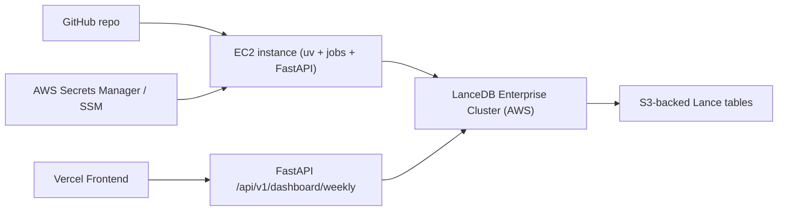

# Deployment Plan: LanceDB Community Metrics (Enterprise + EC2 + Vercel)

## Objective

Move the current local-first setup to a production-style architecture:

1. LanceDB Enterprise is the system of record (`metrics`, `stats`, `history`) on AWS/S3.
2. A small EC2 instance runs scheduled ingestion jobs (`weekly_refresh`) and optional backfills.
3. FastAPI runs on EC2 as a read API for dashboard data.
4. Frontend remains on Vercel and calls FastAPI, not LanceDB directly.

This keeps secrets server-side, minimizes moving parts, and preserves the current code structure.

---

## Target Architecture

### Why this design

FastAPI acts as a secure read boundary between browser clients and LanceDB Enterprise. The browser never receives cluster credentials, and API-level controls (CORS, rate limits, caching, auth) stay centralized.

---

## Phase 0: Local Bootstrap into LanceDB Enterprise

### Goal

Seed the Enterprise cluster from your local machine using the existing CSV-based bootstrap flow, before infrastructure deployment begins.

### Tasks

1. On your local machine, set enterprise connection env vars:
   - `CM_STORAGE_MODE=enterprise`
   - `CM_LANCEDB_URI`
   - `CM_LANCEDB_API_KEY`
2. Run initial seed from `seed_data/` into Enterprise tables:
   - `uv run python -m community_metrics.jobs.seed_from_csv`
3. Optionally recompute recent history to overwrite overlapping seed windows with source-backed rows:
   - `uv run python -m community_metrics.jobs.update_all --lookback-weeks 12`
4. Validate row counts and recent points via API or direct table inspection.

### Acceptance criteria

1. Enterprise `metrics`, `stats`, and `history` tables are created and populated.
2. Seed provenance is visible as `csv_seed`, and recomputed rows as `recomputed` where applicable.
3. A repeat local run is idempotent (no duplicate keys on `(metric_id, period_end)`).

---

## Phase 1: Configuration Refactor (Code Changes)

### Goal

Allow the same codebase to run in either local-file LanceDB mode or Enterprise mode through environment variables.

### Tasks

1. Add a storage mode switch in `src/community_metrics/config.py`.
2. Update `LanceDBStore` construction in `src/community_metrics/storage/lancedb_store.py` to support:
   - Local path mode (existing behavior)
   - Enterprise URI + API key mode
3. Keep ingestion/API code unchanged where possible; only connection initialization should branch by mode.
4. Add clear startup errors for missing required env vars.

### Proposed environment contract

- `CM_STORAGE_MODE` = `local` | `enterprise`
- Local mode:
  - `CM_DB_PATH` (default: `data/community_metrics.lancedb`)
- Enterprise mode:
  - `CM_LANCEDB_URI`
  - `CM_LANCEDB_API_KEY`
  - `CM_LANCEDB_REGION` (optional, if required by SDK/endpoint format)

### Acceptance criteria

1. Local mode still works with current commands.
2. Enterprise mode can run:
   - `uv run python -m community_metrics.jobs.weekly_refresh`
   - `uv run uvicorn community_metrics.api.main:app --reload`
3. No code-paths hardcode local filesystem storage when enterprise mode is selected.

---

## Phase 2: AWS Infrastructure Provisioning

### Goal

Create a minimal, secure runtime environment for jobs + API.

### Tasks

1. Provision EC2 instance (small size; e.g., `t3.small` or `t4g.small` if compatible).
2. Security groups:
   - Allow SSH only from trusted IP/VPN.
   - Allow API port (`80/443` via reverse proxy) from internet.
   - Deny all other inbound ports.
3. DNS + TLS:
   - `metrics-api.<domain>` CNAME/A-record to EC2.
   - TLS via Nginx + Let’s Encrypt (or ALB + ACM).
4. IAM role for EC2:
   - Read-only access to specific Secrets Manager/SSM paths.
   - CloudWatch logs permissions.
5. Secrets in AWS:
   - `CM_STORAGE_MODE=enterprise`
   - `CM_LANCEDB_URI`
   - `CM_LANCEDB_API_KEY`
   - Optional GitHub token for star APIs if needed.

### Acceptance criteria

1. EC2 can read required secrets via IAM role (no static AWS creds on box).
2. API endpoint reachable over HTTPS.
3. No LanceDB credentials present in git repo, Vercel env, or browser.

---

## Phase 3: App Deployment on EC2

### Goal

Run FastAPI continuously and jobs on schedule.

### Tasks

1. Bootstrap host:
   - Install git, Python, uv, Node not required on EC2 for backend-only host.
   - Clone repo into `/opt/community-metrics`.
2. Create runtime env file from secrets (at boot/deploy time), e.g. `/etc/community-metrics.env`.
3. Create `systemd` service for FastAPI:
   - Working directory: `/opt/community-metrics`
   - Exec: `uv run uvicorn community_metrics.api.main:app --host 0.0.0.0 --port 8000`
4. Put Nginx in front of Uvicorn for TLS termination and stable public URL.
5. Create scheduled `systemd` timer for weekly refresh:
   - Service command: `uv run python -m community_metrics.jobs.weekly_refresh`
   - Schedule: weekly (e.g., Monday 06:00 UTC), plus persistent catch-up.

### Suggested timer behavior

Use `Persistent=true` so missed schedules (during reboot) run once at next startup.

### Acceptance criteria

1. `metrics-api.<domain>/api/v1/health` returns `{"status":"ok"}`.
2. Weekly timer executes and writes rows to `history`.
3. Logs are available in journald and optionally shipped to CloudWatch.

---

## Phase 4: Frontend (Vercel) Integration

### Goal

Point dashboard to EC2 API securely and cleanly.

### Tasks

1. Set `VITE_API_BASE_URL=https://metrics-api.<domain>` in Vercel project env.
2. Ensure frontend fetch code uses `VITE_API_BASE_URL` in production.
3. Restrict FastAPI CORS to the exact Vercel domain(s), not `*`.
4. Redeploy Vercel frontend.

### Acceptance criteria

1. Dashboard loads all sections from production API.
2. No browser-visible secrets.
3. CORS permits only allowed frontend origins.

---

## Phase 5: Operations and Runbook

### Weekly normal flow

1. Timer runs `weekly_refresh`.
2. Job upserts latest period rows in `stats`.
3. Dashboard reads updated data through FastAPI.

### On-demand repair/backfill

1. Refresh recent window:
   - `uv run python -m community_metrics.jobs.weekly_refresh --lookback-weeks 4`
2. Rebuild deeper history:
   - `uv run python -m community_metrics.jobs.update_all --lookback-weeks 12`
3. Check run outcomes in `history` table and logs.

### Basic monitoring

1. API health check every 1-5 minutes.
2. Alert if weekly job fails or hasn’t run in >8 days.
3. Alert on repeated partial/failure statuses in `history`.

---

## Security Checklist

1. Separate read vs write LanceDB API keys if supported.
2. Store secrets only in Secrets Manager/SSM.
3. Use least-privilege IAM role for EC2.
4. Restrict SSH and enforce key-based auth.
5. Restrict CORS to Vercel domain(s).
6. Keep OS packages and Python deps patched.

---

## Cost/Complexity Notes

This EC2-first approach is easiest for v1. If usage remains low and you want lower idle cost later, the weekly pipeline can move to EventBridge Scheduler + Lambda/CodeBuild, while keeping the same LanceDB and Vercel structure.

---

## Rollout Checklist

1. Complete Phase 1 config refactor.
2. Validate enterprise connectivity from local machine.
3. Run local bootstrap into Enterprise (`seed_from_csv`, then optional `update_all --lookback-weeks 12`).
4. Provision EC2 + secrets + DNS/TLS.
5. Deploy FastAPI service and verify health endpoint.
6. Enable weekly timer and verify `history` entries.
7. Point Vercel to production API and tighten CORS.
8. Run one manual `weekly_refresh --lookback-weeks 1` sanity update.
9. Declare production ready.
